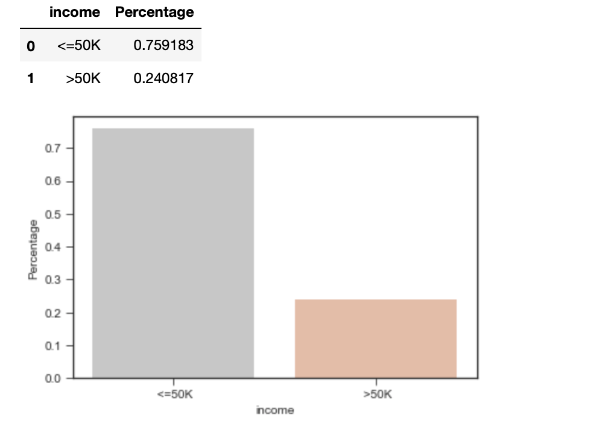

## Classification Algorithm Comparison

Two classification algorithms chosen
1. Decision Tree 
2. KNN

The data set [Link](https://archive.ics.uci.edu/ml/datasets/Census+Income)

After visualizing the "adults.name" and the "adult.data" files, can be able to find there are eight categorical and six continuous attributes.

No missing values or no such data containing "nan". But a few attributes such as workclass, occupation and native_country have the "?" values. So, these values are replaced with the replacing approach called “Mode”.

No such data found with missing or nan

"?" found in 
1. workclass

2. occupation

3. native_country

The replacing approach called `Mode` applied to handle the "?" values.

Some other oberservation were also found, 
1. The number of incomes "<=50K" is around 76% and ">50K" is around 24%. So, the class distribution is moderately imbalanced.

2. There is a significant income difference between people who are working in the 'Private'. Through the graph, we can also see most of the people are from the 'Private' sector.

3. Male has more probability than Female to earn “>50K” income.

4. From the age distribution, we can see the youngest user is 17years the oldest is
90years.

5. Average 45 years people are getting “>50K” and 37 years people are getting “<=
50K”

6. There is a gradual decrease in the number of people earning “<=50K” respectively
when their age gets higher.

After Visualizing the data set, some pre-processing were made to the data set,
1. `Standardization` is applied to handle the outliers.
2. All the categorical data is encoded using `LabelEncoder`.
3. The data set split into 70% as training and 30% as testing datasets.

This data set is used to compare the `Decision Tree` and `KNN` classification algorithm. To create the model, below steps are followed for each algorithm.

#Decision Tree
1. To measure the quality of a split, `Entropy` and `Gini` were used.
2. The maximum depth is in the range of 1 - 32.

Based on the above steps, `Entropy` and depth of 9 are chosen as the best parameters and the algorithm gives an accuracy of 85.43%.

#KNN
1. To calculate the distance metrics of the tree, `euclidean`, `manhattan`, and `minkowski` are used.
2. The number of neighbours used in the range of 1 – 21
3. The weight function used in the predictions are `uniform` and `distance`

Based on the above steps, 19 neighbours, `manhattan` distance metrics and `uniform` weight are chosen as the best parameters and the algorithm gives an accuracy of 83.81%.

Other than calculating the accuracy of these algorithms some other steps done to verify which algorithm is good,
1. Time measured for training and testing.
2. The training data set is split into 1%, 10%, 100% and used to train and then
predict the 30% percentage of an actual data set these splits are applied.
3. F score calculated for each algorithm.

Based on the results that we can come to the consultation, the Decision tree is good to compare to KNN because,
1. For each split of the training data set, the Decision tree algorithm takes less time to train and predict the result.
2. Accuracy: KNN is giving a good result in the lower training data set (1%). But the decision tree is producing the best accuracy for the 10% and 100% of training dataset.
3. F-Score: KNN is giving a good result in the lower training data set (1%). But the decision tree is producing the best F1 score in 10% and 100%, same as accuracy.